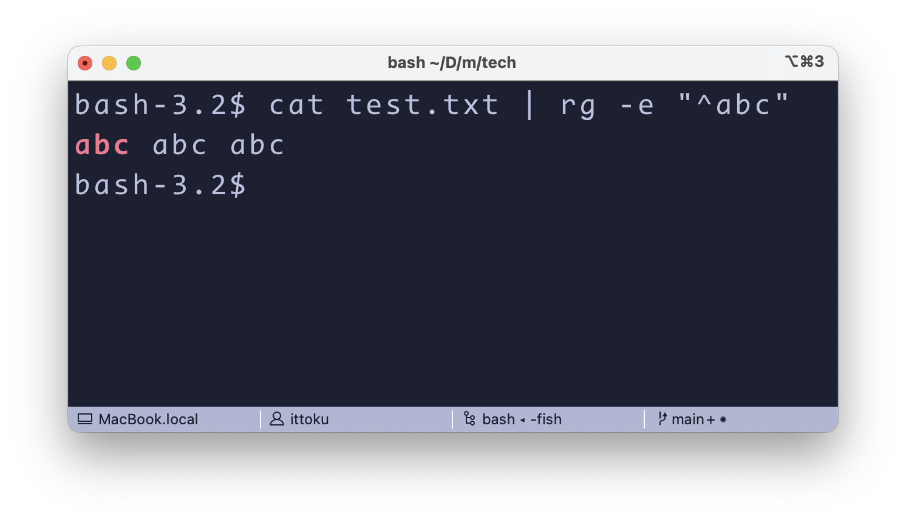
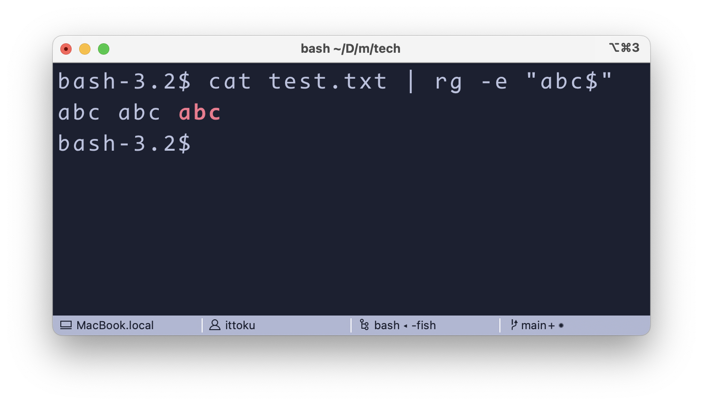
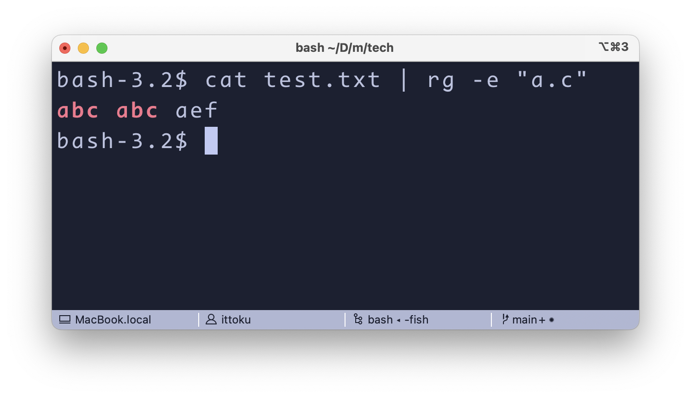
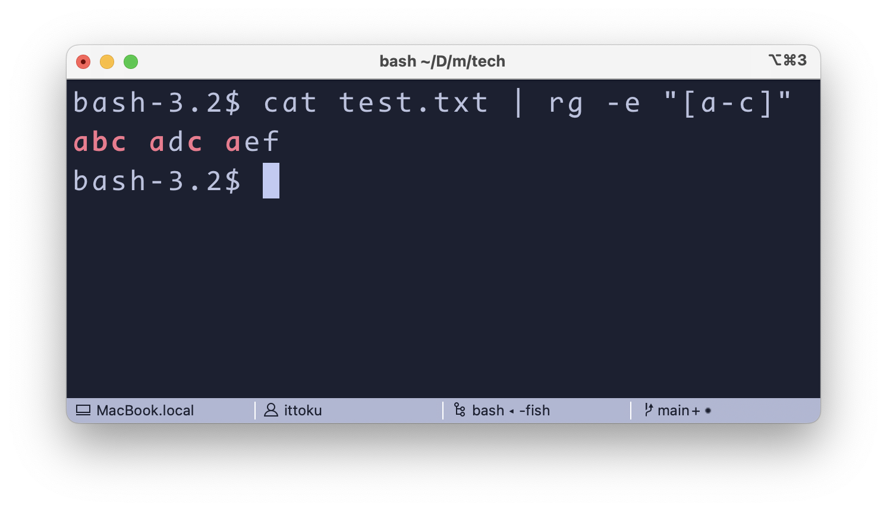
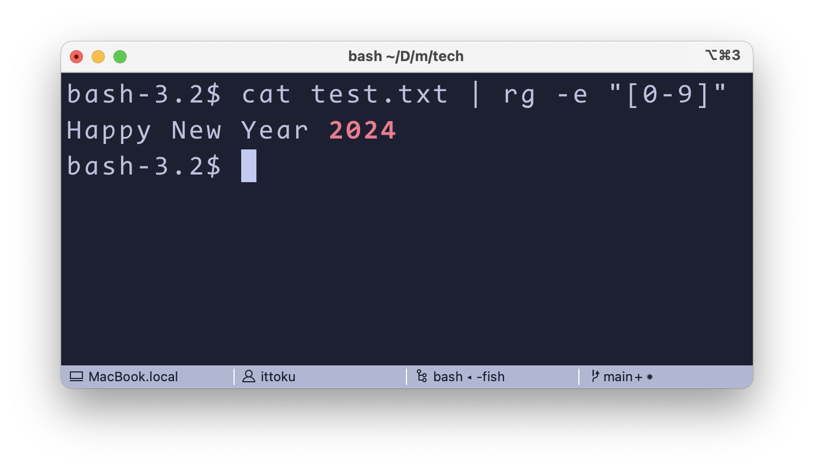
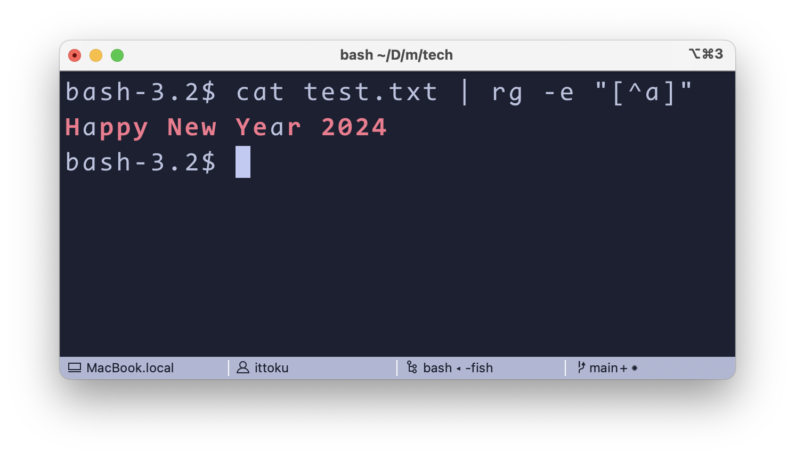
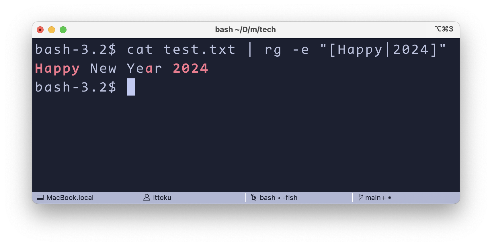
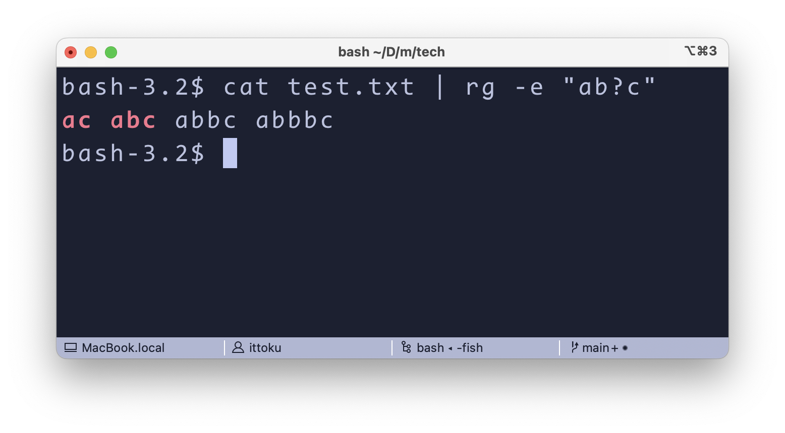
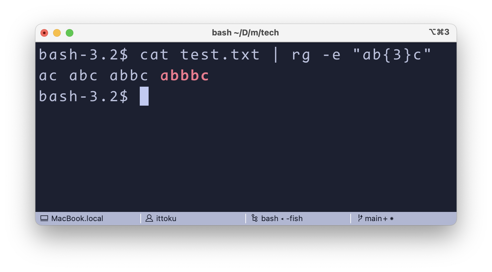
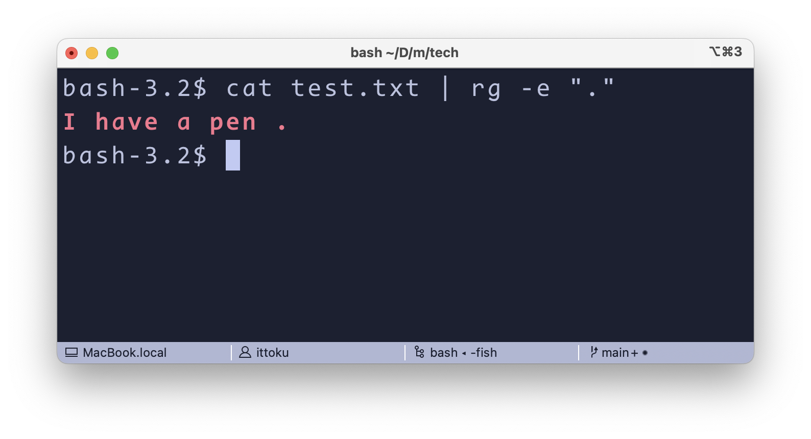

# 正規表現についてまとめてみた

正規表現とは「文字列の集合を1つの文字列で表現する方法の1つである」と[Wikipedia](https://ja.wikipedia.org/wiki/%E6%AD%A3%E8%A6%8F%E8%A1%A8%E7%8F%BE)さんは言っています。

そこで今までどうなっているのかわからずネットに記載されている正規表現を使ってきたが、今こそこの流れを断ち切って、この記事を通して正規表現マスターになろうと思う。

この記事を作成するにあったて参考にしたサイト、URLは以下の通り。

> - https://www.secuavail.com/kb/practical-post/regex-introduction/

では早速やっていきましょう！

## メタ文字とその用途

メタ文字とは、正規表現において特別な意味を持つ文字のことを指します。
正規表現でよく使用するメタ文字は以下の通り。

| metacharacter | meaning |
| ------------- | ------- |
| `^ $`      | 行の先頭、行の最後 |
| `[]`          | 指定した文字のどれか |
| `[^]`         | 指定した文字以外 |
| `\|`          | または |
| `* + ?` | 直前の文字の繰り返し |
| `{}`          | 直前の文字の指定した回数の繰り返し |
| `()`          | グループ化 |
| `\`           | メタ文字の打ち消し |

### 行の先頭`^`と行の最後`$` 

`^`を使用すると行の先頭にある`abc`のみ一致します。

`$`を使用すると行の最後にある`abc`のみ一致します。

### 任意の1文字`.` 

`.`は任意の1文字（なんでも良い1文字）を示します。

よって`a.c`を用いると以下のような結果となり、`abc adc`が一致します。

### 指定した文字の1文字`[]`

`[]`を使用するとその中のどれかの1文字を示すことができます。

よって`[abc]`を用いると、以下のような結果となります。

また`[abc]`は`[a-c]`と等価です。

これと同じように、小文字は`[a-z]`、大文字は`[A-Z]`、数字は`[0-9]`と書くことができます。

`[A-Z]`

`[0-9]`

### 指定した文字以外`[^]`

`[^]`の中に文字を指定することで、その文字以外を指すことができます。

例えば、`a`以外を指定する場合、`[^a]`と書きます。

大文字以外であれば`[^A-Z]`と書きます。

### または`|`

`|`を使用すると、2つ以上の正規表現を示すことができます。

ちなみに複数指定可能です。

### 直前の文字の繰り返し`* + ?`

直前の文字の繰り返しには`* + ?`があり、それぞれ直前の文字の繰り返す数が異なっています。

`*`は0回以上を示します。

`+`は1回以上を示します。

`?`は0または1回を示します。

### 直前の文字の指定した回数の繰り返し`{}`

`{}`の中に任意の数字を入れることで直前の文字の繰り返し数を指定できます。

例えば、`ab{2}c`とすると`abbc`が一致します。

3度繰り返している文字を指定する場合は、`{3}`を指定します。

### グループ化

`()`を使うと任意の文字を1つの単位として扱うことができます。

例えば、`(ab)*c`とすると、`ab`を0回以上繰り返す、と示します。

また、`(ab){2}c`とすると、`ab`を2回繰り返す、と示します。

### メタ文字の打ち消し`\`

`\`はメタ文字の打ち消しに使えます。

例えば、`.`を文字として正規表現に加える場合、メタ文字として`.`は存在しているので、指定できません。

しかし`\.`と指定することで、`.`を文字として示すことができます。

### まとめ

いかがだったでしょうか？正規表現は難しい印象を持ちがちですが、意外と「やれるのでは？」と思った人もいるのではないでしょうか。

正規表現のあの謎の長い呪文のような文字列も、1つ1つ紐解けば案外、簡単なのかもしれません。
